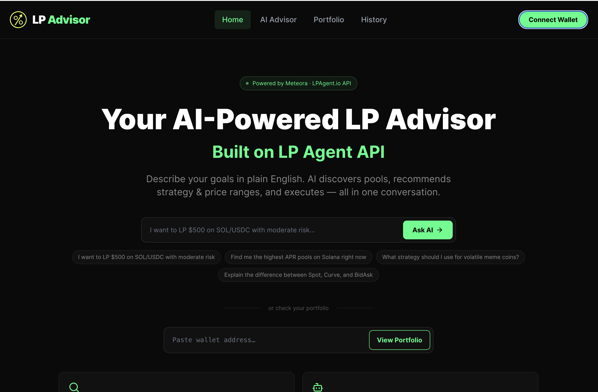

# LP Advisor — AI-Powered LP Portfolio Tracker

> Built on LPAgent.io API · Superteam Frontier Hackathon submission

## Demo

Demo Video: https://youtu.be/tFPU3HxDPPA

GitHub: https://github.com/nanda-1-wq/lp-advisor

## Screenshots



## What it does

LP Advisor is an AI-powered liquidity provision advisor for Meteora pools on Solana. It uses the LPAgent.io API to help users discover pools, analyze portfolios, and execute Zap-In/Zap-Out transactions - all through a natural language AI chat interface.

## Features

- AI Advisor Chat - describe your goals in plain English, get pool recommendations with strategy and price ranges

- Portfolio Tracker - paste any Solana wallet to see all open LP positions with P&L, fees, and bin range visualization

- One-Click Zap-Out - withdraw liquidity from any position with customizable output token and percentage

- Position History - view all closed positions with returns and win rate

- Wallet Connect - Privy integration for MetaMask, Phantom, Trust wallet

## LPAgent.io API Usage

- GET /pools/discover - pool discovery

- GET /lp-positions/opening - open positions

- GET /lp-positions/overview - portfolio metrics

- GET /lp-positions/historical - closed positions

- POST /position/decrease-quotes - Zap-Out quotes

- POST /position/decrease-tx - Zap-Out transactions

## Tech Stack

- React + Vite + TypeScript (frontend)

- Express.js (backend API proxy)

- Groq AI (llama-3.3-70b-versatile) for AI advisor

- Privy for wallet authentication

- LPAgent.io API for all LP data

## Live Demo

Live App: https://lp-advisor.vercel.app

Watch the full demo: https://youtu.be/tFPU3HxDPPA

Features shown in demo:

- Wallet connection via Privy

- AI pool discovery using LPAgent API

- Add Liquidity (Zap-In) flow

- Portfolio tracking with bin range visualization

- Zap-Out with custom amount

- Position history with win rate

## Setup

1. Clone the repo

2. Copy `.env.example` to `.env` and fill in keys

3. Run: `pnpm install && pnpm dev`

## Environment Variables

```
LPAGENT_API_KEY=your_lpagent_key
GROQ_API_KEY=your_groq_key
VITE_PRIVY_APP_ID=your_privy_app_id
USE_MOCK=false
```
